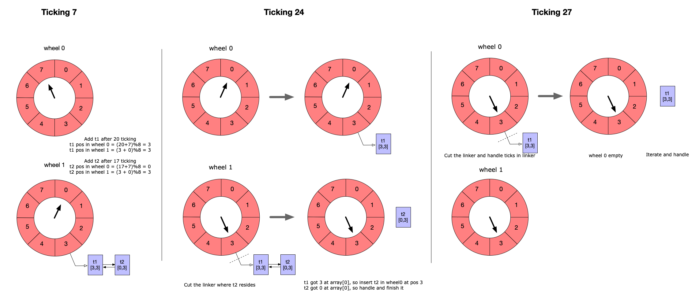

# GO-TIMER

[](https://github.com/singchia/go-xtables/actions/workflows/go.yml)
[](https://opensource.org/licenses/Apache-2.0)
[](https://goreportcard.com/report/github.com/singchia/go-timer/v2)

## Overview

A high performance timer with minimal goroutines.

### How it works



### Features

* One goroutine runs all
* High performance in timing-wheels algorithm
* Minimal resources use
* Managed data and handler
* Customizing channel
* Well tested

## Usage

### Quick Start

```golang
package main

import (
	"log"
	"time"

	timer "github.com/singchia/go-timer/v2"
)

func main() {
	t1 := time.Now()

	t := timer.NewTimer()
	tick := t.Add(time.Second)
	<-tick.C()

	log.Printf("time elapsed: %fs\n", time.Now().Sub(t1).Seconds())
}
```

### Async handler

```golang
package main

import (
	"log"
	"sync"
	"time"

	timer "github.com/singchia/go-timer/v2"
)

func main() {
	wg := sync.WaitGroup{}
	wg.Add(1)

	t := timer.NewTimer()
	t.Add(time.Second, timer.WithData(time.Now()), timer.WithHandler(func(event *timer.Event) {
		defer wg.Done()
		log.Printf("time elapsed: %fs\n", time.Now().Sub(event.Data.(time.Time)).Seconds())
	}))

	wg.Wait()
}
```

### With cyclically

```golang
package main

import (
	"log"
	"time"

	timer "github.com/singchia/go-timer/v2"
)

func main() {
	t1 := time.Now()

	t := timer.NewTimer()
	tick := t.Add(time.Second, timer.WithCyclically())
	for {
		<-tick.C()
		t2 := time.Now()
		log.Printf("time elapsed: %fs\n", t2.Sub(t1).Seconds())
		t1 = t2
	}
}
```

## License

© Austin Zhai, 2015-2025

Released under the [Apache License 2.0](https://github.com/singchia/go-timer/blob/master/LICENSE)